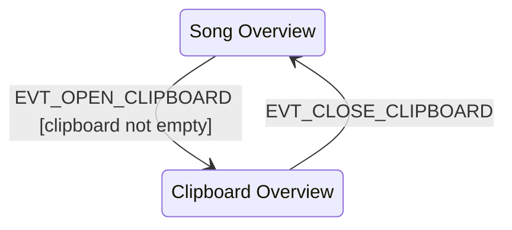
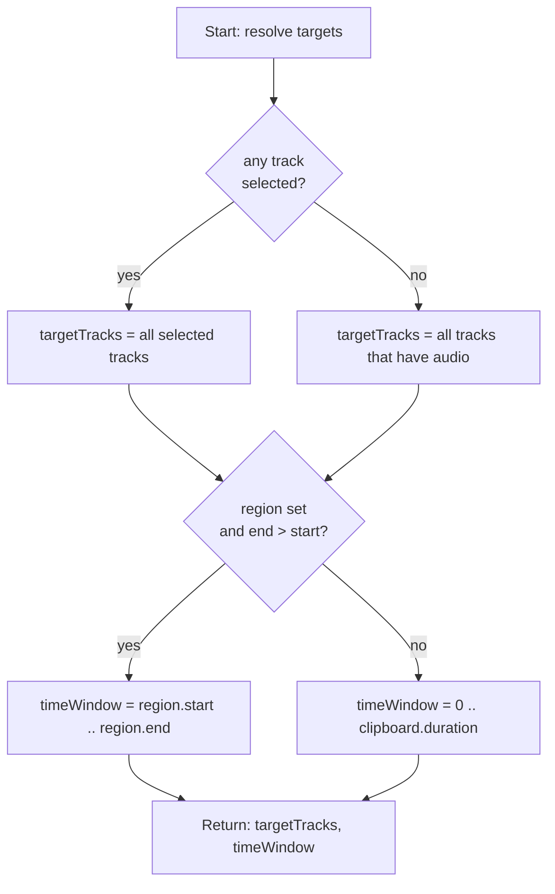
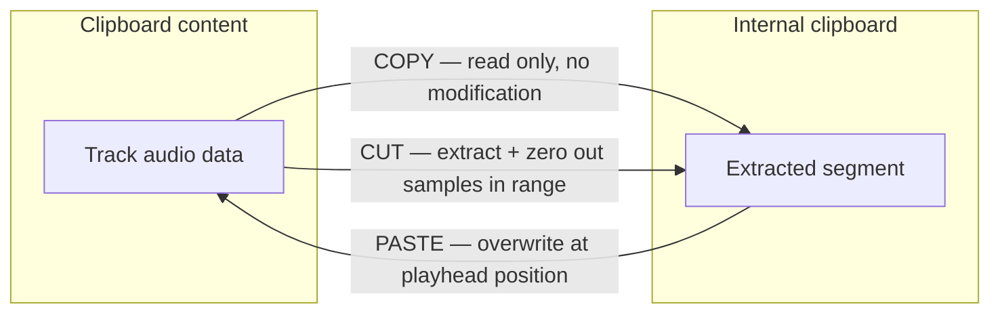
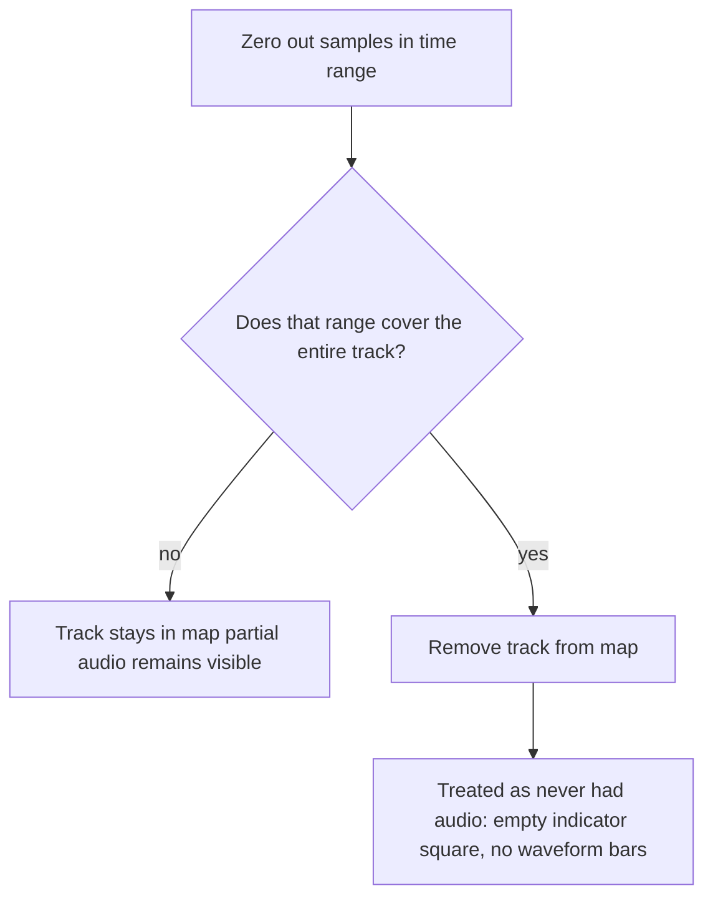
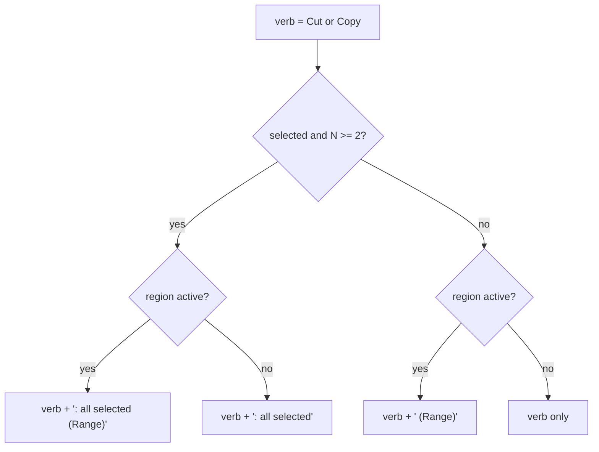

# Clipboard Overview & Modifier Workflow — Specification

This document describes the **Clipboard Overview mode** and its **Modifier actions** for implementation on the physical Track8 device. All input bindings, rendering technology, and audio APIs are device-specific and excluded here. This document covers the abstract logic, states, and algorithms.

---

## A. System Overview

The main screen AUDIO OVERVIEW operates in one of two **mutually exclusive modes**:

| Aspect | Song Overview (default) | Clipboard Overview (modal) |
|--------|------------------------|---------------------------|
| Audio displayed | Song tracks (fixed 8-track recording) | Clipboard content (variable N tracks, duration defined by longest clipboarded track) |
| Playback | Song position | Independent clipboard position |
| Track interaction | Mute / Select | Select only |
| Edit operations | CUT / COPY → main 8-track clipboard | CUT / COPY → internal invisble clipboard (isolated) |
| PASTE | From main clipboard into song | From internal clipboard into clipboard content |
| Visual indicator | — | Orange border around display |
| UNDO/REDO | yes, no changes | none |

**Clipboard** = a shared data structure holding up to 8 audio tracks with a fixed duration. It is populated by CUT or COPY operations in song mode. Clipboard Overview lets the user inspect, navigate, and further process this content with "clipboard modifiers".

---

## B. State Model

```
ClipboardOverlayState {
  active:            bool          // clipboard overview on/off

  playhead:          seconds       // current position within clipboard (0..duration)
  playing:           bool

  selectedTracks:    bool[8]       // per-track selection (green highlight)
  region:            { start: seconds, end: seconds } | null
                                   // time region for operations (a.k.a 'selection'); null = no region

  modVol:            int           // -60..0, unit: dB, neutral = 0
  modPan:            int           // -100..100, step 10, neutral = 0
                                   // negative = left, positive = right
  modSpeedIdx:       int           // index into fixed speed-ratio table, neutral = 1×

  internalClipboard: ClipboardData | null  // isolated from song clipboard
}

ClipboardData {
  tracks:    Map<trackIndex(0..7), AudioTrack>
  duration:  seconds
}
```

On **entry** all overlay fields are reset to neutral (see section C). `internalClipboard` is always null on entry and on exit.

---

## C. Mode Entry and Exit

### State Machine



### Entry Pseudocode

```
on EVT_OPEN_CLIPBOARD:
  if clipboard.tracks.size == 0: return  // guard: nothing to show

  pause song playback (if playing)
  build audio playback engine from clipboard.tracks
  compute waveform display data from clipboard.tracks

  overlay.active          = true
  overlay.playhead        = 0
  overlay.playing         = false
  overlay.selectedTracks  = [false × 8]
  overlay.region          = null
  overlay.modVol          = 0
  overlay.modPan          = 0
  overlay.modSpeedIdx     = NEUTRAL_SPEED
  overlay.internalClipboard = null
```

### Exit Pseudocode

```
on EVT_CLOSE_CLIPBOARD:
  stop clipboard playback
  release clipboard audio engine
  overlay.active            = false
  overlay.internalClipboard = null
  // song playhead position is preserved, song remains paused
```

---

## D. Track Selection Model in Clipboard Overview

Track selection governs which tracks are affected by all edit and modifier operations.

| Event | Behavior |
|-------|----------|
| EVT_SELECT_TRACK(i) | **Exclusive:** deselect all, select only track i |
| EVT_TOGGLE_TRACK(i) | **Multi-toggle:** flip track i, others unchanged |

**Visual:** selected tracks render with a distinct highlight color (see section J).

---

## E. Region Selection

The region marks a **time window** (start … end) within the clipboard duration. They are set with Track8's Loop-Marker Keys. When no region is set, all operations apply to the full clipboard duration of all selected tracks.

```
on EVT_SET_REGION_START:
  t = clamp(current_playhead, 0, clipboard.duration)
  if region != null and region.end > t:
    region.start = t           // keep existing end if valid
  else:
    region = { start: t, end: OPEN }   // end not yet set

on EVT_SET_REGION_END:
  t = clamp(current_playhead, 0, clipboard.duration)
  start = region?.start ?? 0
  if t <= start + EPSILON:
    region = null              // invalid end clears region
  else:
    region = { start: start, end: t }
```

Region is visualised as a cyan overlay band across all track lanes.

---

## F. Target Resolution

Every edit and modifier operation resolves **which tracks** and **which time window** to act on using the same algorithm:



All operations below (CUT, COPY, PASTE, VOL, PAN, FADE, REVERSE, SPEED) call this resolution first.

---

## G. CUT / COPY / PASTE within Clipboard Overview

These operations use an **internal clipboard** (`internalClipboard`) that is separate from the song's main clipboard. Changes made here do not affect the song until the user exits clipboard mode and explicitly pastes into the song.
By the transient nature of the clipboard it does not need its own UNDO/REDO, because the user can always exit Clipboard-Overview and recreate the clipboards contents (admittedly, in the case of a former CUT operation, he would have to UNDO that cut first in order to CUT-to-clipboard again).

### Operation Flow

All Cut/Copy/Paste operation are very much like the user is used to in normal track8 cut/copy/paste operations!

**Data flow:**



**CUT side effect — track map cleanup:**


### COPY Pseudocode

```
on EVT_COPY:
  { targetTracks, timeWindow } = resolveTargets()
  if clipboard.duration <= 0: return

  internalClipboard = new ClipboardData {
    duration = timeWindow.end - timeWindow.start
  }
  for each track in targetTracks:
    segment = extractSamples(clipboard.tracks[track], timeWindow)
    internalClipboard.tracks[track] = segment

  // Toast message depends on how many tracks are targeted and whether a region is active:
  //   anySelected = at least one track selection flag is set
  //   N           = number of tracks actually operated on
  //   regionActive = a valid region (end > start) was set
  if anySelected and N >= 2:
    show toast regionActive ? "Copy: all selected (Range)" : "Copy: all selected"
  else:
    show toast regionActive ? "Copy (Range)" : "Copy"
```

### CUT Pseudocode

```
on EVT_CUT:
  { targetTracks, timeWindow } = resolveTargets()
  if clipboard.duration <= 0: return

  internalClipboard = new ClipboardData { duration = timeWindow.end - timeWindow.start }

  for each track in targetTracks:
    segment = extractSamples(clipboard.tracks[track], timeWindow)
    internalClipboard.tracks[track] = segment

    silence(clipboard.tracks[track], timeWindow)
    recomputeWaveform(track)

    if timeWindow covers entire track duration:
      clipboard.tracks.delete(track)  // track is now empty → remove entirely

  // Same toast logic as COPY, with verb "Cut":
  if anySelected and N >= 2:
    show toast regionActive ? "Cut: all selected (Range)" : "Cut: all selected"
  else:
    show toast regionActive ? "Cut (Range)" : "Cut"
```

> When a track is removed from `clipboard.tracks`, all consumers treat it as "no audio": it renders grey, its indicator square appears empty, and PASTE does not target it by default.

### PASTE Pseudocode

```
on EVT_PASTE:
  if internalClipboard == null: return
  pastePosition = current_playhead

  if internalClipboard has exactly 1 track:
    destTrack = first selected track, or source track index from internalClipboard
    overwriteSamples(clipboard.tracks[destTrack], internalClipboard.tracks[0], pastePosition)
    recomputeWaveform(destTrack)
  else:
    for each (srcTrack, data) in internalClipboard.tracks:
      overwriteSamples(clipboard.tracks[srcTrack], data, pastePosition)
      recomputeWaveform(srcTrack)

  show toast "Paste"
```

---

## H. Modifier Actions

Modifiers transform the audio content of the clipboard in-place. All use the same target-resolution (section F). After each modifier execution: waveform display is recomputed for affected tracks.

### Overview Table

| Modifier | Adjustable value | Range | Applied on |
|----------|-----------------|-------|-----------|
| VOL | gain in dB | -60..0 dB | click after setting value |
| PAN | stereo balance | -100 (full L) .. 100 (full R), step 10 | click after setting value |
| FADE | direction (in / out) | — | immediate click |
| REVERSE | — | — | immediate click |
| SPEED | ratio (from fixed table) | e.g. 0.5×, 0.75×, 1×, 1.5×, 2× | click after setting value |

### Interaction Model (VOL / PAN / SPEED)

Use your track8 encoder rotation functions to set paramters. Here in this prototype its a mouse-drag gesture:
```
Drag gesture:
  on DRAG_START(slot):   record startValue, startPosition
  on DRAG_MOVE(delta):   newValue = clamp(startValue + scale(delta))
                         update display label (preview only, no audio change)
  on DRAG_END:
    if |totalDelta| < THRESHOLD:   // short press = "click"
      if newValue != neutral:
        executeModifier(newValue)
    else:
      discard (drag was for preview only)
```

FADE and REVERSE have no preview value — they execute immediately on any press event (no drag needed).

### CMD Bar Slot Layout (Clipboard Mode)

```
[  1/4  ][  VOL  ][  PAN  ][ FADE-IN ][REVERSE][ SPEED ][       ][ SCROLL ]
  slot 0   slot 1   slot 2   slot 3   slot 4   slot 5    slot 6    slot 7
```

Slots 0 and 7 are always present (step division and scroll mode). Slots 1–5 appear only in clipboard mode.
Slot 3 changes on SHIFT-DOWN to "FADE-OUT"

### VOL

```
on EVT_APPLY_VOL(db):
  { targetTracks, timeWindow } = resolveTargets()
  gain = 10 ^ (db / 20)             // convert dB to linear
  for each track in targetTracks:
    for each sample s in timeWindow:
      s *= gain                      // apply to all channels
  recomputeWaveform(track)
  show toast "Vol: {db} dB"
```

### PAN

Applies equal-power stereo balance. **Should you habe Mono tracks they'd be unaffected.**

```
on EVT_APPLY_PAN(panValue):
  { targetTracks, timeWindow } = resolveTargets()
  panNorm = panValue / 100           // -1.0 .. 1.0
  leftGain  = cos((panNorm + 1) * π / 4)
  rightGain = sin((panNorm + 1) * π / 4)

  for each track in targetTracks:
    if track.channels < 2: skip      // mono → unchanged
    for each sample position in timeWindow:
      L_new = L * leftGain
      R_new = R * rightGain
  recomputeWaveform(track)
  show toast "Pan: {formatted}"
```

### FADE

Linear amplitude envelope over the time window.

```
on EVT_APPLY_FADE(direction):   // direction: 'in' or 'out'
  { targetTracks, timeWindow } = resolveTargets()
  len = timeWindow.end - timeWindow.start  (in samples)

  for each track in targetTracks:
    for each sample i in timeWindow (offset from window start):
      t = i / len                  // 0.0 at start, 1.0 at end
      factor = if direction == 'out': (1 - t)
               else:                  t
      sample *= factor
  recomputeWaveform(track)
  show toast "Fade Out" / "Fade In"
```

### REVERSE

In-place sample order reversal. Idempotent when applied twice.

```
on EVT_APPLY_REVERSE():
  { targetTracks, timeWindow } = resolveTargets()

  for each track in targetTracks:
    for each channel:
      swap samples from both ends of timeWindow inward until meeting in center
      // i.e. swap(window[0], window[last]),  swap(window[1], window[last-1]),  …
  recomputeWaveform(track)
  show toast "Reverse"
```

### SPEED

Speed change is a **black box** from this specification's perspective: the device implementation must choose its own resampling or time-stretch strategy.
Remark from Stephan: "I don't get the use in even the smaller ratios like 1.33 or 0.75. What's the use???? The semitone or cent-wise pitch changes i did understand."

```
on EVT_APPLY_SPEED(ratio):
  { targetTracks, timeWindow } = resolveTargets()

  for each track in targetTracks:
    newAudio = resampleOrTimeStretch(audio in timeWindow, ratio)
    replace timeWindow with newAudio
                                     // note: at ratio != 1, audio length changes
  update clipboard.duration accordingly
  recomputeWaveform(all affected tracks)
  show toast "Speed: x{ratio}"   // ratio with fixed decimal formatting, e.g. x0.50
```

---

## I. Visual Feedback Summary

### Mode Indicator

A continuous **orange border** drawn around the full display perimeter signals that clipboard overview is active. Absent in AUDIO OVerview mode.

### Waveform Track Colors (Clipboard Mode)

| Track has audio | Track is selected | Color |
|----------------|------------------|-------|
| yes | no | normal (white) |
| no | no | muted (grey) |
| yes | yes | selected (bright green) |
| no | yes | muted-selected (dark green) |

Waveform bars are only drawn for tracks that have audio (`tracks.has(track)`). Tracks without audio show only a dotted centerline in their muted color.

### Top TIME GRID Bar - Active Segment Highlight (AUDIO Overview only)

The time grid band (the narrow strip between the command bar and the track lanes) always shows which **section** between two markers (and/or start and end) the playhead is currently inside. The width of that section is filled with a **very faint orange tint** and changes live depending on playhead/cursorposition.

```
on every display frame (song mode only):
  section = the interval [ markerBefore(playhead) .. markerAfter(playhead) ]
  fill time-grid band from section.start to section.end  with faint-orange tint
```

This highlight is **passive** — it requires no user action and updates continuously as the playhead moves or markers are added/removed. It provides at-a-glance confirmation of which section CUT / COPY would operate on.

The highlight is **absent in Clipboard Overview mode** (the clipboard has no marker system and no section concept).

### Bottom Bar Indicator Squares

Eight squares at the bottom of the display. Each square corresponds to one track index. **Filled** = that track has clipboard audio content. **Empty** = no clipboard audio for that track. This display is identical in song mode and clipboard mode — it always reflects `clipboard.tracks`.

### Toast Notifications

Brief text overlays after operations. **Variant:** `success` for command confirmations; `error` for the copy/paste length limit message below.

#### Song overview — CUT / COPY (main clipboard)

The time range is always the **current section** between markers (or song bounds). Target tracks depend on the command variant:

| Command variant | Toast text |
|-----------------|------------|
| CUT, selected track only | `Cut` |
| CUT, all unmuted tracks | `Cut: all unmuted` |
| COPY, selected track only | `Copy` |
| COPY, all unmuted tracks | `Copy: all unmuted` |

#### Clipboard overview — internal CUT / COPY

Let **verb** be `Cut` or `Copy`. **Region active** = a valid region is set (`end > start`). **Target list** = tracks resolved for the operation (selected tracks if any flag is set, otherwise every track that holds clipboard audio). **N** = number of tracks in that target list.

| Condition | Toast text |
|-----------|------------|
| N ≥ 2, user had at least one track selected, region active | `Cut: all selected (Range)` or `Copy: all selected (Range)` |
| N ≥ 2, user had at least one track selected, no region | `Cut: all selected` or `Copy: all selected` |
| N = 1, user had at least one track selected, region active | `Cut (Range)` or `Copy (Range)` |
| N = 1, user had at least one track selected, no region | `Cut` or `Copy` |
| User selected no tracks (fallback = all tracks with audio), region active | `Cut (Range)` or `Copy (Range)` |
| User selected no tracks, no region | `Cut` or `Copy` |

Decision tree (same for Cut and Copy; **selected** = “any track selection flag set”):



#### Clipboard overview — internal PASTE

| Condition | Toast text |
|-----------|------------|
| Paste applied | `Paste` |

#### Clipboard overview — modifiers

| Modifier | Toast pattern | Example values |
|----------|---------------|----------------|
| VOL | `Vol: {label}` | `Vol: 0 dB`, `Vol: -12 dB` (integer dB; `0 dB` spelled out when neutral) |
| PAN | `Pan: {label}` | `Pan: 0`, `Pan: 30L`, `Pan: 50R` |
| FADE OUT | fixed | `Fade Out` |
| FADE IN | fixed | `Fade In` |
| REVERSE | fixed | `Reverse` |
| SPEED | `Speed: x{ratio}` | Ratio formatted with two fractional digits (e.g. `Speed: x0.50`, `Speed: x1.33`). No toast when the speed control is at the neutral ratio (apply is not invoked). |