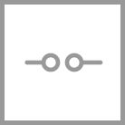

# Icons Overview

Rendered via standalone SVG files (GitHub/Markdown-safe): `icons/individual/*.svg`

## Dark Icons

-  `audio-overview-dark`
-  `midi-overview-dark`
-  `master-fx-dark`
-  `audio-midi-browser-dark`
-  `set-marker-dark`
-  `cut-area-dark`
-  `copy-area-dark`
-  `paste-at-position-dark`
-  `toggle-loop-dark`
-  `set-punch-in-dark`
-  `set-punch-out-dark`
-  `arm-record-dark`
-  `shift-dark`
-  `play-pause-dark`
-  `jump-left-dark`
-  `jump-right-dark`
-  `track-key-1-dark`
-  `track-key-2-dark`
-  `track-key-3-dark`
-  `track-key-4-dark`
-  `track-key-5-dark`
-  `track-key-6-dark`
-  `track-key-7-dark`
-  `track-key-8-dark`

## OUtline Icons for dark theme
-  `audio-overview-light`
-  `midi-overview-light`
-  `master-fx-light`
-  `audio-midi-browser-light`
-  `set-marker-light`
-  `cut-area-light`
-  `copy-area-light`
-  `paste-at-position-light`
-  `toggle-loop-light`
-  `set-punch-in-light`
-  `set-punch-out-light`
-  `arm-record-light`
-  `shift-light`
-  `play-pause-light`
-  `jump-left-light`
-  `jump-right-light`
-  `track-key-1-light`
-  `track-key-2-light`
-  `track-key-3-light`
-  `track-key-4-light`
-  `track-key-5-light`
-  `track-key-6-light`
-  `track-key-7-light`
-  `track-key-8-light`

## Outline Icons for light theme (grey)
-  `audio-overview-light`
-  `midi-overview-light`
-  `master-fx-light`
-  `audio-midi-browser-light`
-  `set-marker-light`
-  `cut-area-light`
-  `copy-area-light`
-  `paste-at-position-light`
-  `toggle-loop-light`
-  `set-punch-in-light`
-  `set-punch-out-light`
-  `arm-record-light`
-  `shift-light`
-  `play-pause-light`
-  `jump-left-light`
-  `jump-right-light`
-  `track-key-1-light`
-  `track-key-2-light`
-  `track-key-3-light`
-  `track-key-4-light`
-  `track-key-5-light`
-  `track-key-6-light`
-  `track-key-7-light`
-  `track-key-8-light`
